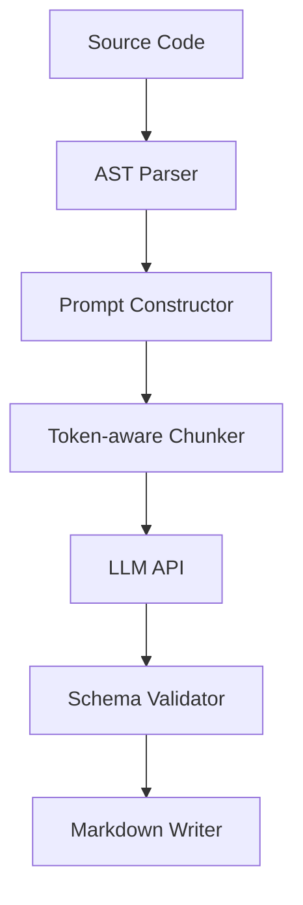
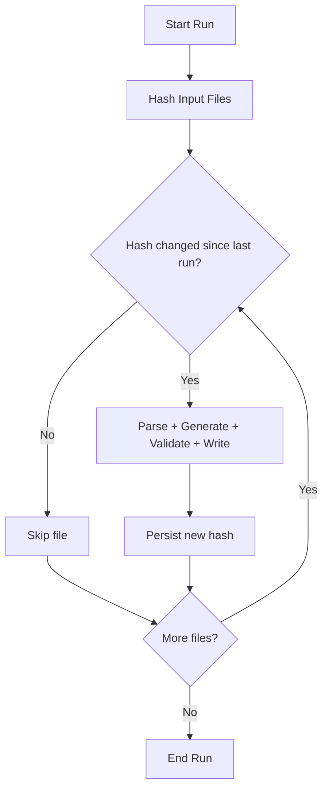

# AutoDocs

[](https://www.typescriptlang.org/)
[](https://github.com/features/actions)
[](https://www.docker.com/)
[](https://platform.openai.com/)

Generate high-signal markdown docs from TypeScript and TSX source files using AST extraction plus schema-validated LLM output.

## Problem Statement
Engineering teams ship APIs and components faster than they can maintain docs. Manual documentation drifts, examples become stale, and code review velocity drops. AutoDocs automates source-to-doc generation so references stay current and enforceable.

## Pipeline


### Incremental changed-file detection


## Engineering Decisions
- **AST over raw text**: preserves signatures, types, and export intent instead of heuristic parsing.
- **Token-aware chunking**: keeps prompts within model limits while retaining semantic boundaries.
- **JSON schema validation + retry**: invalid model responses are rejected and regenerated deterministically.
- **Incremental file hashing**: unchanged files skip expensive generation work.
- **Docker containerisation**: reproducible CI execution and environment parity across machines.

## Quick Start
### 1) Install
```bash
npm install
```

### 2) Run mock mode
```bash
npm run build
node dist/index.js --mock ./examples/sample-input
```

### 3) GitHub Actions snippet
```yaml
- name: Build
  run: npm run build

- name: Generate docs in mock mode
  run: node dist/index.js --mock ./examples/sample-input
```

### 4) Required environment variables
| Variable | Required | Purpose |
| --- | --- | --- |
| `OPENAI_API_KEY` | Yes (live mode) | Auth for model calls when mock mode is disabled. |
| `AUTODOCS_MODEL` | No | Override default model identifier. |
| `AUTODOCS_OUTPUT_DIR` | No | Override docs output directory. |

## Before / After
### Before
```ts
export const truncate = (input: string, maxLength: number): string => {
  const symbols = Array.from(input);
  if (symbols.length <= maxLength) return input;
  return `${symbols.slice(0, maxLength - 1).join('')}…`;
};
```

### After
```md
### truncate(input, maxLength)
Truncates by Unicode symbols and appends an ellipsis when clipping is required.

| Parameter | Type | Description |
| --- | --- | --- |
| input | string | String to shorten safely. |
| maxLength | number | Max symbol length including ellipsis. |
```

## Architecture Overview
- `parser/`: AST traversal and typed symbol extraction.
- `prompt/`: deterministic prompt assembly and context shaping.
- `llm/`: provider adapters and retry orchestration.
- `validator/`: response schema checks and structured error surfaces.
- `writer/`: markdown rendering and file emission.
- `cli/`: command parsing, mode selection, and execution lifecycle.

## Roadmap
1. Add provider failover across multiple model backends with health scoring.
2. Generate framework-specific examples (React, Node, and SDK clients) from one schema.
3. Publish a prebuilt Docker image with pinned runtime and default workflow templates.
